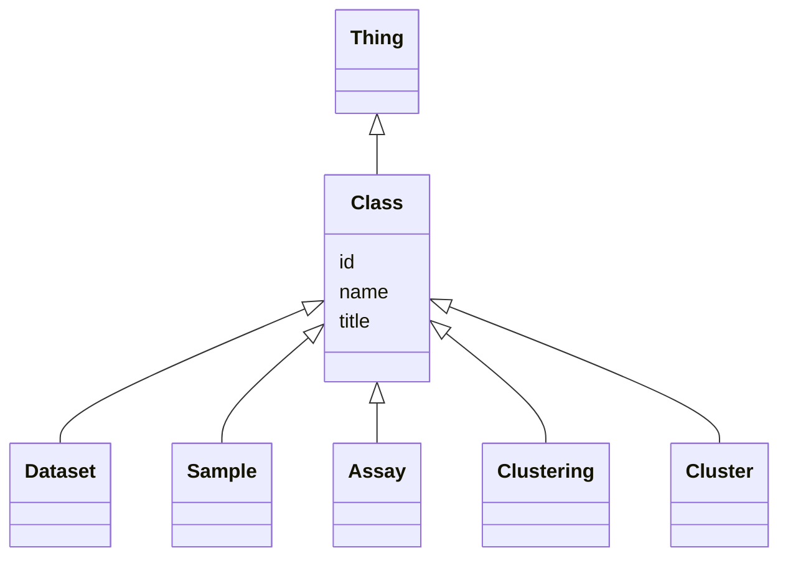

# Class: Class


URI: [http://github.org/vfb/vfb-scRNAseq-ontology/VFB_scRNAseq/:Class](http://github.org/vfb/vfb-scRNAseq-ontology/VFB_scRNAseq/:Class)





## Inheritance
* [Thing](Thing.md)
    * **Class**
        * [Dataset](Dataset.md)
        * [Sample](Sample.md)
        * [Assay](Assay.md)
        * [Clustering](Clustering.md)
        * [Cluster](Cluster.md)


## Slots

| Name | Cardinality and Range | Description | Inheritance |
| ---  | --- | --- | --- |
| [name](name.md) | 0..1 _recommended_ <br/> [String](String.md) | Short systematic label for the entity | direct |
| [title](title.md) | 0..1 _recommended_ <br/> [String](String.md) | Short description of the entity | direct |
| [id](id.md) | 1 <br/> [Uriorcurie](Uriorcurie.md) | Identifier for the entity | [Thing](Thing.md) |


## Usages

| used by | used in | type | used |
| ---  | --- | --- | --- |
| [Clustering](Clustering.md) | [associated_sample_or_assay_for_clustering](associated_sample_or_assay_for_clustering.md) | range | [Class](Class.md) |


## Identifier and Mapping Information


### Annotations

| property | value |
| --- | --- |
| owl | NamedIndividual |


### Schema Source


* from schema: http://github.org/vfb/vfb-scRNAseq-ontology/VFB_scRNAseq


## Mappings

| Mapping Type | Mapped Value |
| ---  | ---  |
| self | http://github.org/vfb/vfb-scRNAseq-ontology/VFB_scRNAseq/:Class |
| native | http://github.org/vfb/vfb-scRNAseq-ontology/VFB_scRNAseq/:Class |


## LinkML Source

<!-- TODO: investigate https://stackoverflow.com/questions/37606292/how-to-create-tabbed-code-blocks-in-mkdocs-or-sphinx -->

### Direct

<details>
```yaml
name: Class
annotations:
  owl:
    tag: owl
    value: NamedIndividual
from_schema: http://github.org/vfb/vfb-scRNAseq-ontology/VFB_scRNAseq
is_a: Thing
slots:
- name
- title

```
</details>

### Induced

<details>
```yaml
name: Class
annotations:
  owl:
    tag: owl
    value: NamedIndividual
from_schema: http://github.org/vfb/vfb-scRNAseq-ontology/VFB_scRNAseq
is_a: Thing
attributes:
  name:
    name: name
    annotations:
      owl:
        tag: owl
        value: AnnotationAssertion
    description: Short systematic label for the entity.
    from_schema: http://github.org/vfb/vfb-scRNAseq-ontology/VFB_scRNAseq
    rank: 1000
    slot_uri: rdfs:label
    alias: name
    owner: Class
    domain_of:
    - Class
    range: string
    recommended: true
  title:
    name: title
    annotations:
      owl:
        tag: owl
        value: AnnotationAssertion
    description: Short description of the entity.
    from_schema: http://github.org/vfb/vfb-scRNAseq-ontology/VFB_scRNAseq
    rank: 1000
    slot_uri: IAO:0000115
    alias: title
    owner: Class
    domain_of:
    - Class
    range: string
    recommended: true
  id:
    name: id
    description: Identifier for the entity. FlyBase identifiers should be prefixed
      with 'FlyBase:'.
    from_schema: http://github.org/vfb/vfb-scRNAseq-ontology/VFB_scRNAseq
    rank: 1000
    identifier: true
    alias: id
    owner: Class
    domain_of:
    - Thing
    range: uriorcurie
    required: true

```
</details>