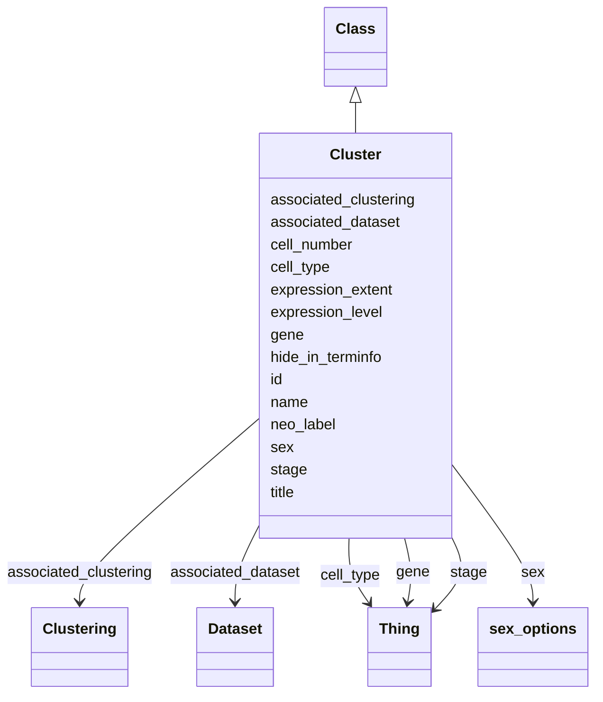

# Class: Cluster


URI: [FBcv:0009003](http://purl.obolibrary.org/obo/FBcv_0009003)





## Inheritance
* [Thing](Thing.md)
    * [Class](Class.md)
        * **Cluster**


## Slots

| Name | Cardinality and Range | Description | Inheritance |
| ---  | --- | --- | --- |
| [stage](stage.md) | 0..1 <br/> [Thing](Thing.md) | Developmental stage (FBdv ID) of the Sample or Cluster | direct |
| [associated_dataset](associated_dataset.md) | 0..1 <br/> [Dataset](Dataset.md) | Dataset (FBlc ID) that the Sample or Cluster belongs to | direct |
| [sex](sex.md) | 0..1 <br/> [SexOptions](SexOptions.md) | Sex for the entity | direct |
| [neo_label](neo_label.md) | 0..1 <br/> [String](String.md) | neo4j node label to add to entity | direct |
| [gene](gene.md) | 0..1 <br/> [Thing](Thing.md) | A gene (FBgn ID) that is expressed by the entity | direct |
| [expression_level](expression_level.md) | 0..1 <br/> [Float](Float.md) | Level of expression of the given gene | direct |
| [expression_extent](expression_extent.md) | 0..1 <br/> [Float](Float.md) | Extent of expression of the given gene | direct |
| [hide_in_terminfo](hide_in_terminfo.md) | 0..1 <br/> [String](String.md) | Flag to hide expression edges in VFB Term Info pane | direct |
| [associated_clustering](associated_clustering.md) | 0..1 <br/> [Clustering](Clustering.md) | Clustering (FBlc ID) that the Cluster belongs to | direct |
| [cell_number](cell_number.md) | 0..1 <br/> [Integer](Integer.md) | The number of cells in the Cluster (as integer) | direct |
| [cell_type](cell_type.md) | 0..* <br/> [Thing](Thing.md) | Anatomy (FBbt IDs) for the Cluster | direct |
| [name](name.md) | 0..1 _recommended_ <br/> [String](String.md) | Short systematic label for the entity | [Class](Class.md) |
| [title](title.md) | 0..1 _recommended_ <br/> [String](String.md) | Short description of the entity | [Class](Class.md) |
| [id](id.md) | 1..1 <br/> [Uriorcurie](Uriorcurie.md) | Identifier for the entity | [Thing](Thing.md) |


## Identifier and Mapping Information


### Annotations

| property | value |
| --- | --- |
| owl.fstring | ClassAssertion( FBcv:0009003 {id} ) |


### Schema Source


* from schema: http://github.org/vfb/vfb-scRNAseq-ontology/VFB_scRNAseq


## Mappings

| Mapping Type | Mapped Value |
| ---  | ---  |
| self | FBcv:0009003 |
| native | http://github.org/vfb/vfb-scRNAseq-ontology/VFB_scRNAseq/:Cluster |


## LinkML Source

<!-- TODO: investigate https://stackoverflow.com/questions/37606292/how-to-create-tabbed-code-blocks-in-mkdocs-or-sphinx -->

### Direct

<details>
```yaml
name: Cluster
annotations:
  owl.fstring:
    tag: owl.fstring
    value: ClassAssertion( FBcv:0009003 {id} )
from_schema: http://github.org/vfb/vfb-scRNAseq-ontology/VFB_scRNAseq
is_a: Class
slots:
- stage
- associated_dataset
- sex
- neo_label
- gene
- expression_level
- expression_extent
- hide_in_terminfo
attributes:
  associated_clustering:
    name: associated_clustering
    annotations:
      owl:
        tag: owl
        value: ObjectPropertyAssertion
    description: Clustering (FBlc ID) that the Cluster belongs to.
    from_schema: http://github.org/vfb/vfb-scRNAseq-ontology/VFB_scRNAseq
    rank: 1000
    slot_uri: BFO:0000050
    domain_of:
    - Cluster
    range: Clustering
  cell_number:
    name: cell_number
    annotations:
      owl.fstring:
        tag: owl.fstring
        value: DataPropertyAssertion( BAO:0002811 {id} {cell_number} ^^xsd:integer
          )
    description: The number of cells in the Cluster (as integer).
    from_schema: http://github.org/vfb/vfb-scRNAseq-ontology/VFB_scRNAseq
    rank: 1000
    slot_uri: BAO:0002811
    domain_of:
    - Cluster
    range: integer
  cell_type:
    name: cell_type
    annotations:
      owl.fstring:
        tag: owl.fstring
        value: ClassAssertion( ObjectSomeValuesFrom( RO:0002473 {V} ) {id} )
    description: Anatomy (FBbt IDs) for the Cluster. Multiple IDs should be separated
      with '|'.
    from_schema: http://github.org/vfb/vfb-scRNAseq-ontology/VFB_scRNAseq
    rank: 1000
    slot_uri: RO:0002473
    multivalued: true
    domain_of:
    - Cluster
    range: Thing
class_uri: FBcv:0009003

```
</details>

### Induced

<details>
```yaml
name: Cluster
annotations:
  owl.fstring:
    tag: owl.fstring
    value: ClassAssertion( FBcv:0009003 {id} )
from_schema: http://github.org/vfb/vfb-scRNAseq-ontology/VFB_scRNAseq
is_a: Class
attributes:
  associated_clustering:
    name: associated_clustering
    annotations:
      owl:
        tag: owl
        value: ObjectPropertyAssertion
    description: Clustering (FBlc ID) that the Cluster belongs to.
    from_schema: http://github.org/vfb/vfb-scRNAseq-ontology/VFB_scRNAseq
    rank: 1000
    slot_uri: BFO:0000050
    alias: associated_clustering
    owner: Cluster
    domain_of:
    - Cluster
    range: Clustering
  cell_number:
    name: cell_number
    annotations:
      owl.fstring:
        tag: owl.fstring
        value: DataPropertyAssertion( BAO:0002811 {id} {cell_number} ^^xsd:integer
          )
    description: The number of cells in the Cluster (as integer).
    from_schema: http://github.org/vfb/vfb-scRNAseq-ontology/VFB_scRNAseq
    rank: 1000
    slot_uri: BAO:0002811
    alias: cell_number
    owner: Cluster
    domain_of:
    - Cluster
    range: integer
  cell_type:
    name: cell_type
    annotations:
      owl.fstring:
        tag: owl.fstring
        value: ClassAssertion( ObjectSomeValuesFrom( RO:0002473 {V} ) {id} )
    description: Anatomy (FBbt IDs) for the Cluster. Multiple IDs should be separated
      with '|'.
    from_schema: http://github.org/vfb/vfb-scRNAseq-ontology/VFB_scRNAseq
    rank: 1000
    slot_uri: RO:0002473
    multivalued: true
    alias: cell_type
    owner: Cluster
    domain_of:
    - Cluster
    range: Thing
  stage:
    name: stage
    annotations:
      owl.fstring:
        tag: owl.fstring
        value: ClassAssertion( ObjectSomeValuesFrom( RO:0002490 {V} ) {id} )
    description: Developmental stage (FBdv ID) of the Sample or Cluster.
    from_schema: http://github.org/vfb/vfb-scRNAseq-ontology/VFB_scRNAseq
    rank: 1000
    slot_uri: RO:0002490
    alias: stage
    owner: Cluster
    domain_of:
    - Sample
    - Cluster
    range: Thing
  associated_dataset:
    name: associated_dataset
    annotations:
      owl.fstring:
        tag: owl.fstring
        value: AnnotationAssertion( dcterms:source {id} {V} )
    description: Dataset (FBlc ID) that the Sample or Cluster belongs to.
    from_schema: http://github.org/vfb/vfb-scRNAseq-ontology/VFB_scRNAseq
    rank: 1000
    slot_uri: dcterms:source
    alias: associated_dataset
    owner: Cluster
    domain_of:
    - Sample
    - Assay
    - Clustering
    - Cluster
    range: Dataset
  sex:
    name: sex
    annotations:
      owl.fstring:
        tag: owl.fstring
        value: ClassAssertion( ObjectSomeValuesFrom( BFO:0000050 {V} ) {id} )
    description: Sex for the entity. Should be 'male' or 'female'.
    from_schema: http://github.org/vfb/vfb-scRNAseq-ontology/VFB_scRNAseq
    rank: 1000
    slot_uri: BFO:0000050
    alias: sex
    owner: Cluster
    domain_of:
    - Sample
    - Cluster
    range: sex_options
  neo_label:
    name: neo_label
    annotations:
      owl:
        tag: owl
        value: AnnotationProperty
    description: neo4j node label to add to entity.
    from_schema: http://github.org/vfb/vfb-scRNAseq-ontology/VFB_scRNAseq
    rank: 1000
    slot_uri: neo_property:nodeLabel
    alias: neo_label
    owner: Cluster
    domain_of:
    - Dataset
    - Sample
    - Assay
    - Cluster
    - Publication
    range: string
  gene:
    name: gene
    annotations:
      owl.template:
        tag: owl.template
        value: "\nClassAssertion ( \n    Annotation ( neo_custom:hide_in_terminfo\
          \ {{hide_in_terminfo}} ) \n    Annotation ( neo_custom:expression_level\
          \ {{expression_level}} ) \n    \n    Annotation\
          \ ( neo_custom:expression_extent {{expression_extent}} ) \n    \n    ObjectSomeValuesFrom ( RO:0002292 {{gene}}) {{id}})\n"
    description: A gene (FBgn ID) that is expressed by the entity. Max one gene per
      tsv row alongside its expression_level, expression_extent (for scRNAseq clusters)
      and hide_in_terminfo (=true).
    from_schema: http://github.org/vfb/vfb-scRNAseq-ontology/VFB_scRNAseq
    rank: 1000
    slot_uri: RO:0002292
    alias: gene
    owner: Cluster
    domain_of:
    - Cluster
    range: Thing
  expression_level:
    name: expression_level
    description: Level of expression of the given gene.
    from_schema: http://github.org/vfb/vfb-scRNAseq-ontology/VFB_scRNAseq
    rank: 1000
    slot_uri: neo_custom:expression_level
    alias: expression_level
    owner: Cluster
    domain_of:
    - Cluster
    range: float
  expression_extent:
    name: expression_extent
    description: Extent of expression of the given gene.
    from_schema: http://github.org/vfb/vfb-scRNAseq-ontology/VFB_scRNAseq
    rank: 1000
    slot_uri: neo_custom:expression_extent
    alias: expression_extent
    owner: Cluster
    domain_of:
    - Cluster
    range: float
  hide_in_terminfo:
    name: hide_in_terminfo
    description: Flag to hide expression edges in VFB Term Info pane. Range must be
      string - boolean changes capitalisation and does not add datatype anyway.
    from_schema: http://github.org/vfb/vfb-scRNAseq-ontology/VFB_scRNAseq
    rank: 1000
    slot_uri: neo_custom:hide_in_terminfo
    alias: hide_in_terminfo
    owner: Cluster
    domain_of:
    - Cluster
    range: string
  name:
    name: name
    annotations:
      owl:
        tag: owl
        value: AnnotationAssertion
    description: Short systematic label for the entity.
    from_schema: http://github.org/vfb/vfb-scRNAseq-ontology/VFB_scRNAseq
    rank: 1000
    slot_uri: rdfs:label
    alias: name
    owner: Cluster
    domain_of:
    - Class
    range: string
    recommended: true
  title:
    name: title
    annotations:
      owl:
        tag: owl
        value: AnnotationAssertion
    description: Short description of the entity.
    from_schema: http://github.org/vfb/vfb-scRNAseq-ontology/VFB_scRNAseq
    rank: 1000
    slot_uri: IAO:0000115
    alias: title
    owner: Cluster
    domain_of:
    - Class
    range: string
    recommended: true
  id:
    name: id
    description: Identifier for the entity. FlyBase identifiers should be prefixed
      with 'FlyBase:'.
    from_schema: http://github.org/vfb/vfb-scRNAseq-ontology/VFB_scRNAseq
    rank: 1000
    identifier: true
    alias: id
    owner: Cluster
    domain_of:
    - Thing
    range: uriorcurie
    required: true
class_uri: FBcv:0009003

```
</details>