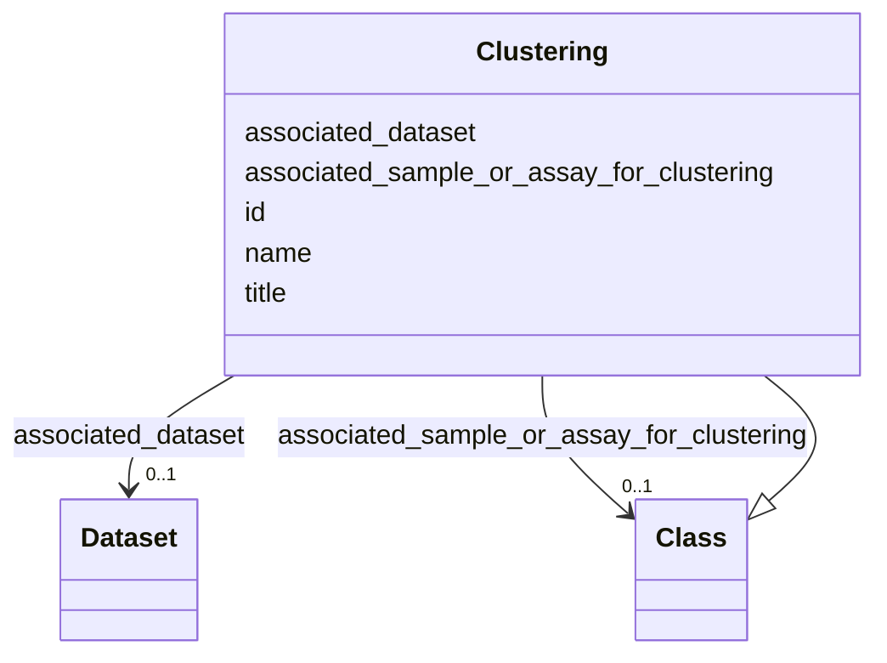

# Class: Clustering


URI: [FBcv:0009002](http://purl.obolibrary.org/obo/FBcv_0009002)





## Inheritance
* [Thing](Thing.md)
    * [Class](Class.md)
        * **Clustering**


## Slots

| Name | Cardinality and Range | Description | Inheritance |
| ---  | --- | --- | --- |
| [associated_dataset](associated_dataset.md) | 0..1 <br/> [Dataset](Dataset.md) | Dataset (FBlc ID) that the Sample or Cluster belongs to | direct |
| [associated_sample_or_assay_for_clustering](associated_sample_or_assay_for_clustering.md) | 0..1 <br/> [Class](Class.md) | Sample or Assay (FBlc ID) that the Clustering uses | direct |
| [name](name.md) | 0..1 _recommended_ <br/> [String](String.md) | Short systematic label for the entity | [Class](Class.md) |
| [title](title.md) | 0..1 _recommended_ <br/> [String](String.md) | Short description of the entity | [Class](Class.md) |
| [id](id.md) | 1 <br/> [Uriorcurie](Uriorcurie.md) | Identifier for the entity | [Thing](Thing.md) |


## Usages

| used by | used in | type | used |
| ---  | --- | --- | --- |
| [Cluster](Cluster.md) | [associated_clustering](associated_clustering.md) | range | [Clustering](Clustering.md) |


## Identifier and Mapping Information


### Annotations

| property | value |
| --- | --- |
| owl.fstring | ClassAssertion( FBcv:0009002 {id} ) |


### Schema Source


* from schema: http://github.org/vfb/vfb-scRNAseq-ontology/VFB_scRNAseq


## Mappings

| Mapping Type | Mapped Value |
| ---  | ---  |
| self | FBcv:0009002 |
| native | http://github.org/vfb/vfb-scRNAseq-ontology/VFB_scRNAseq/:Clustering |


## LinkML Source

<!-- TODO: investigate https://stackoverflow.com/questions/37606292/how-to-create-tabbed-code-blocks-in-mkdocs-or-sphinx -->

### Direct

<details>
```yaml
name: Clustering
annotations:
  owl.fstring:
    tag: owl.fstring
    value: ClassAssertion( FBcv:0009002 {id} )
from_schema: http://github.org/vfb/vfb-scRNAseq-ontology/VFB_scRNAseq
is_a: Class
slots:
- associated_dataset
attributes:
  associated_sample_or_assay_for_clustering:
    name: associated_sample_or_assay_for_clustering
    annotations:
      owl:
        tag: owl
        value: ObjectPropertyAssertion
    description: Sample or Assay (FBlc ID) that the Clustering uses.
    from_schema: http://github.org/vfb/vfb-scRNAseq-ontology/VFB_scRNAseq
    rank: 1000
    slot_uri: BFO:0000051
    domain_of:
    - Clustering
    range: Class
class_uri: FBcv:0009002

```
</details>

### Induced

<details>
```yaml
name: Clustering
annotations:
  owl.fstring:
    tag: owl.fstring
    value: ClassAssertion( FBcv:0009002 {id} )
from_schema: http://github.org/vfb/vfb-scRNAseq-ontology/VFB_scRNAseq
is_a: Class
attributes:
  associated_sample_or_assay_for_clustering:
    name: associated_sample_or_assay_for_clustering
    annotations:
      owl:
        tag: owl
        value: ObjectPropertyAssertion
    description: Sample or Assay (FBlc ID) that the Clustering uses.
    from_schema: http://github.org/vfb/vfb-scRNAseq-ontology/VFB_scRNAseq
    rank: 1000
    slot_uri: BFO:0000051
    alias: associated_sample_or_assay_for_clustering
    owner: Clustering
    domain_of:
    - Clustering
    range: Class
  associated_dataset:
    name: associated_dataset
    annotations:
      owl.fstring:
        tag: owl.fstring
        value: AnnotationAssertion( dc:source {id} {V} )
    description: Dataset (FBlc ID) that the Sample or Cluster belongs to.
    from_schema: http://github.org/vfb/vfb-scRNAseq-ontology/VFB_scRNAseq
    rank: 1000
    slot_uri: dc:source
    alias: associated_dataset
    owner: Clustering
    domain_of:
    - Sample
    - Assay
    - Clustering
    - Cluster
    range: Dataset
  name:
    name: name
    annotations:
      owl:
        tag: owl
        value: AnnotationAssertion
    description: Short systematic label for the entity.
    from_schema: http://github.org/vfb/vfb-scRNAseq-ontology/VFB_scRNAseq
    rank: 1000
    slot_uri: rdfs:label
    alias: name
    owner: Clustering
    domain_of:
    - Class
    range: string
    recommended: true
  title:
    name: title
    annotations:
      owl:
        tag: owl
        value: AnnotationAssertion
    description: Short description of the entity.
    from_schema: http://github.org/vfb/vfb-scRNAseq-ontology/VFB_scRNAseq
    rank: 1000
    slot_uri: IAO:0000115
    alias: title
    owner: Clustering
    domain_of:
    - Class
    range: string
    recommended: true
  id:
    name: id
    description: Identifier for the entity. FlyBase identifiers should be prefixed
      with 'FlyBase:'.
    from_schema: http://github.org/vfb/vfb-scRNAseq-ontology/VFB_scRNAseq
    rank: 1000
    identifier: true
    alias: id
    owner: Clustering
    domain_of:
    - Thing
    range: uriorcurie
    required: true
class_uri: FBcv:0009002

```
</details>