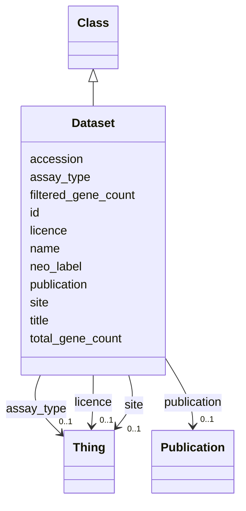

# Class: Dataset


URI: [FBcv:0003023](http://purl.obolibrary.org/obo/FBcv_0003023)





## Inheritance
* [Thing](Thing.md)
    * [Class](Class.md)
        * **Dataset**


## Slots

| Name | Cardinality and Range | Description | Inheritance |
| ---  | --- | --- | --- |
| [neo_label](neo_label.md) | 0..1 <br/> [String](String.md) | neo4j node label to add to entity | direct |
| [total_gene_count](total_gene_count.md) | 0..1 <br/> [Integer](Integer.md) | Total number of distinct genes associated with the entity before filtering by... | direct |
| [filtered_gene_count](filtered_gene_count.md) | 0..1 <br/> [Integer](Integer.md) | Total number of distinct genes associated with the entity after filtering by ... | direct |
| [publication](publication.md) | 0..1 <br/> [Publication](Publication.md) | Publication associated with the Dataset | direct |
| [licence](licence.md) | 0..1 <br/> [Thing](Thing.md) | Licence for the Dataset (all CC-BY 4 | direct |
| [assay_type](assay_type.md) | 0..1 <br/> [Thing](Thing.md) | Assay type (FBcv ID) for the Dataset, this will probably be 'FBcv:0009000' ('... | direct |
| [site](site.md) | 0..1 <br/> [Thing](Thing.md) | VFB site node curie | direct |
| [accession](accession.md) | 0..1 <br/> [String](String.md) | Accession of the Dataset at the given Site | direct |
| [name](name.md) | 0..1 _recommended_ <br/> [String](String.md) | Short systematic label for the entity | [Class](Class.md) |
| [title](title.md) | 0..1 _recommended_ <br/> [String](String.md) | Short description of the entity | [Class](Class.md) |
| [id](id.md) | 1 <br/> [Uriorcurie](Uriorcurie.md) | Identifier for the entity | [Thing](Thing.md) |


## Usages

| used by | used in | type | used |
| ---  | --- | --- | --- |
| [Sample](Sample.md) | [associated_dataset](associated_dataset.md) | range | [Dataset](Dataset.md) |
| [Assay](Assay.md) | [associated_dataset](associated_dataset.md) | range | [Dataset](Dataset.md) |
| [Clustering](Clustering.md) | [associated_dataset](associated_dataset.md) | range | [Dataset](Dataset.md) |
| [Cluster](Cluster.md) | [associated_dataset](associated_dataset.md) | range | [Dataset](Dataset.md) |


## Identifier and Mapping Information


### Annotations

| property | value |
| --- | --- |
| owl.fstring | ClassAssertion( FBcv:0003023 {id} ) |


### Schema Source


* from schema: http://github.org/vfb/vfb-scRNAseq-ontology/VFB_scRNAseq


## Mappings

| Mapping Type | Mapped Value |
| ---  | ---  |
| self | FBcv:0003023 |
| native | http://github.org/vfb/vfb-scRNAseq-ontology/VFB_scRNAseq/:Dataset |


## LinkML Source

<!-- TODO: investigate https://stackoverflow.com/questions/37606292/how-to-create-tabbed-code-blocks-in-mkdocs-or-sphinx -->

### Direct

<details>
```yaml
name: Dataset
annotations:
  owl.fstring:
    tag: owl.fstring
    value: ClassAssertion( FBcv:0003023 {id} )
from_schema: http://github.org/vfb/vfb-scRNAseq-ontology/VFB_scRNAseq
is_a: Class
slots:
- neo_label
- total_gene_count
- filtered_gene_count
attributes:
  publication:
    name: publication
    annotations:
      owl.fstring:
        tag: owl.fstring
        value: AnnotationAssertion( dc:references {id} {V} )
    description: Publication associated with the Dataset.
    from_schema: http://github.org/vfb/vfb-scRNAseq-ontology/VFB_scRNAseq
    rank: 1000
    slot_uri: dc:references
    domain_of:
    - Dataset
    range: Publication
  licence:
    name: licence
    annotations:
      owl.fstring:
        tag: owl.fstring
        value: AnnotationAssertion( dc:licence {id} {V} )
    description: Licence for the Dataset (all CC-BY 4.0 for scExpressionAtlas).
    from_schema: http://github.org/vfb/vfb-scRNAseq-ontology/VFB_scRNAseq
    rank: 1000
    slot_uri: dc:licence
    domain_of:
    - Dataset
    range: Thing
  assay_type:
    name: assay_type
    annotations:
      owl.fstring:
        tag: owl.fstring
        value: ClassAssertion( ObjectSomeValuesFrom( OBI:0000312 {V} ) {id} )
    description: Assay type (FBcv ID) for the Dataset, this will probably be 'FBcv:0009000'
      ('single-cell RNA-seq').
    from_schema: http://github.org/vfb/vfb-scRNAseq-ontology/VFB_scRNAseq
    rank: 1000
    slot_uri: OBI:0000312
    domain_of:
    - Dataset
    range: Thing
  site:
    name: site
    annotations:
      owl.fstring:
        tag: owl.fstring
        value: AnnotationAssertion( Annotation( neo_custom:accession {accession} )
          oboInOwl:hasDbXref {id} {V} )
    description: VFB site node curie. The site must be created in VFB and added to
      the dictionary in ../scripts/process_site_data.py to successfully map from FB
      data.
    from_schema: http://github.org/vfb/vfb-scRNAseq-ontology/VFB_scRNAseq
    rank: 1000
    slot_uri: oboInOwl:hasDbXref
    domain_of:
    - Dataset
    range: Thing
  accession:
    name: accession
    description: Accession of the Dataset at the given Site.
    from_schema: http://github.org/vfb/vfb-scRNAseq-ontology/VFB_scRNAseq
    rank: 1000
    slot_uri: neo_custom:accession
    domain_of:
    - Dataset
    range: string
class_uri: FBcv:0003023

```
</details>

### Induced

<details>
```yaml
name: Dataset
annotations:
  owl.fstring:
    tag: owl.fstring
    value: ClassAssertion( FBcv:0003023 {id} )
from_schema: http://github.org/vfb/vfb-scRNAseq-ontology/VFB_scRNAseq
is_a: Class
attributes:
  publication:
    name: publication
    annotations:
      owl.fstring:
        tag: owl.fstring
        value: AnnotationAssertion( dc:references {id} {V} )
    description: Publication associated with the Dataset.
    from_schema: http://github.org/vfb/vfb-scRNAseq-ontology/VFB_scRNAseq
    rank: 1000
    slot_uri: dc:references
    alias: publication
    owner: Dataset
    domain_of:
    - Dataset
    range: Publication
  licence:
    name: licence
    annotations:
      owl.fstring:
        tag: owl.fstring
        value: AnnotationAssertion( dc:licence {id} {V} )
    description: Licence for the Dataset (all CC-BY 4.0 for scExpressionAtlas).
    from_schema: http://github.org/vfb/vfb-scRNAseq-ontology/VFB_scRNAseq
    rank: 1000
    slot_uri: dc:licence
    alias: licence
    owner: Dataset
    domain_of:
    - Dataset
    range: Thing
  assay_type:
    name: assay_type
    annotations:
      owl.fstring:
        tag: owl.fstring
        value: ClassAssertion( ObjectSomeValuesFrom( OBI:0000312 {V} ) {id} )
    description: Assay type (FBcv ID) for the Dataset, this will probably be 'FBcv:0009000'
      ('single-cell RNA-seq').
    from_schema: http://github.org/vfb/vfb-scRNAseq-ontology/VFB_scRNAseq
    rank: 1000
    slot_uri: OBI:0000312
    alias: assay_type
    owner: Dataset
    domain_of:
    - Dataset
    range: Thing
  site:
    name: site
    annotations:
      owl.fstring:
        tag: owl.fstring
        value: AnnotationAssertion( Annotation( neo_custom:accession {accession} )
          oboInOwl:hasDbXref {id} {V} )
    description: VFB site node curie. The site must be created in VFB and added to
      the dictionary in ../scripts/process_site_data.py to successfully map from FB
      data.
    from_schema: http://github.org/vfb/vfb-scRNAseq-ontology/VFB_scRNAseq
    rank: 1000
    slot_uri: oboInOwl:hasDbXref
    alias: site
    owner: Dataset
    domain_of:
    - Dataset
    range: Thing
  accession:
    name: accession
    description: Accession of the Dataset at the given Site.
    from_schema: http://github.org/vfb/vfb-scRNAseq-ontology/VFB_scRNAseq
    rank: 1000
    slot_uri: neo_custom:accession
    alias: accession
    owner: Dataset
    domain_of:
    - Dataset
    range: string
  neo_label:
    name: neo_label
    annotations:
      owl:
        tag: owl
        value: AnnotationProperty
    description: neo4j node label to add to entity.
    from_schema: http://github.org/vfb/vfb-scRNAseq-ontology/VFB_scRNAseq
    rank: 1000
    slot_uri: neo_property:nodeLabel
    alias: neo_label
    owner: Dataset
    domain_of:
    - Dataset
    - Sample
    - Assay
    - Cluster
    - Publication
    range: string
  total_gene_count:
    name: total_gene_count
    annotations:
      owl:
        tag: owl
        value: AnnotationProperty
    description: Total number of distinct genes associated with the entity before
      filtering by extent.
    from_schema: http://github.org/vfb/vfb-scRNAseq-ontology/VFB_scRNAseq
    rank: 1000
    slot_uri: neo_custom:total_gene_count
    alias: total_gene_count
    owner: Dataset
    domain_of:
    - Dataset
    - Cluster
    range: integer
  filtered_gene_count:
    name: filtered_gene_count
    annotations:
      owl:
        tag: owl
        value: AnnotationProperty
    description: Total number of distinct genes associated with the entity after filtering
      by extent.
    from_schema: http://github.org/vfb/vfb-scRNAseq-ontology/VFB_scRNAseq
    rank: 1000
    slot_uri: neo_custom:filtered_gene_count
    alias: filtered_gene_count
    owner: Dataset
    domain_of:
    - Dataset
    - Cluster
    range: integer
  name:
    name: name
    annotations:
      owl:
        tag: owl
        value: AnnotationAssertion
    description: Short systematic label for the entity.
    from_schema: http://github.org/vfb/vfb-scRNAseq-ontology/VFB_scRNAseq
    rank: 1000
    slot_uri: rdfs:label
    alias: name
    owner: Dataset
    domain_of:
    - Class
    range: string
    recommended: true
  title:
    name: title
    annotations:
      owl:
        tag: owl
        value: AnnotationAssertion
    description: Short description of the entity.
    from_schema: http://github.org/vfb/vfb-scRNAseq-ontology/VFB_scRNAseq
    rank: 1000
    slot_uri: IAO:0000115
    alias: title
    owner: Dataset
    domain_of:
    - Class
    range: string
    recommended: true
  id:
    name: id
    description: Identifier for the entity. FlyBase identifiers should be prefixed
      with 'FlyBase:'.
    from_schema: http://github.org/vfb/vfb-scRNAseq-ontology/VFB_scRNAseq
    rank: 1000
    identifier: true
    alias: id
    owner: Dataset
    domain_of:
    - Thing
    range: uriorcurie
    required: true
class_uri: FBcv:0003023

```
</details>