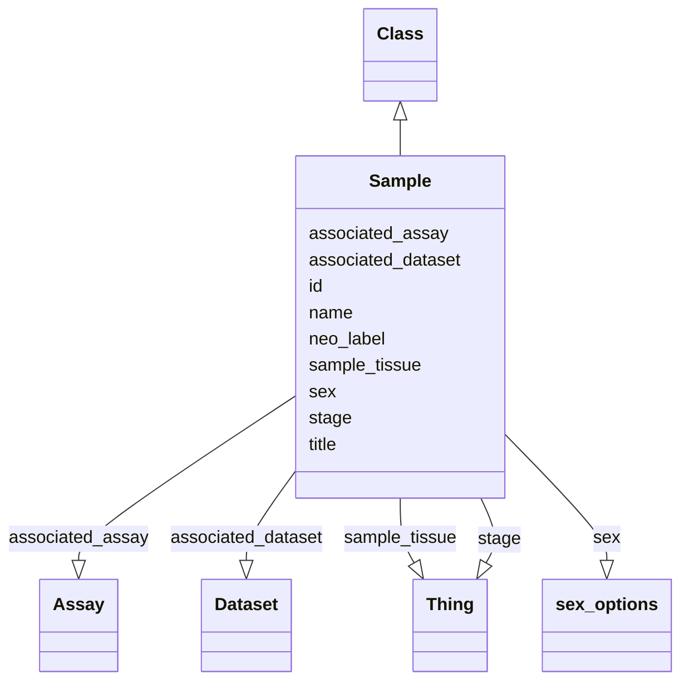

# Class: Sample


URI: [FBcv:0003024](http://purl.obolibrary.org/obo/FBcv_0003024)





## Inheritance
* [Thing](Thing.md)
    * [Class](Class.md)
        * **Sample**


## Slots

| Name | Cardinality and Range | Description | Inheritance |
| ---  | --- | --- | --- |
| [stage](stage.md) | 0..1 <br/> [Thing](Thing.md) | Developmental stage (FBdv ID) of the Sample or Cluster | direct |
| [associated_dataset](associated_dataset.md) | 0..1 <br/> [Dataset](Dataset.md) | Dataset (FBlc ID) that the Sample or Cluster belongs to | direct |
| [sex](sex.md) | 0..1 <br/> [SexOptions](SexOptions.md) | Sex for the entity | direct |
| [neo_label](neo_label.md) | 0..1 <br/> [String](String.md) | neo4j node label to add to entity | direct |
| [sample_tissue](sample_tissue.md) | 0..* <br/> [Thing](Thing.md) | Tissue(s) (FBbt IDs) in the sample | direct |
| [associated_assay](associated_assay.md) | 0..* <br/> [Assay](Assay.md) | Assay(s) that use this sample | direct |
| [name](name.md) | 0..1 _recommended_ <br/> [String](String.md) | Short systematic label for the entity | [Class](Class.md) |
| [title](title.md) | 0..1 _recommended_ <br/> [String](String.md) | Short description of the entity | [Class](Class.md) |
| [id](id.md) | 1..1 <br/> [Uriorcurie](Uriorcurie.md) | Identifier for the entity | [Thing](Thing.md) |


## Usages

| used by | used in | type | used |
| ---  | --- | --- | --- |
| [Assay](Assay.md) | [associated_sample_for_assay](associated_sample_for_assay.md) | range | [Sample](Sample.md) |


## Identifier and Mapping Information


### Annotations

| property | value |
| --- | --- |
| owl.fstring | ClassAssertion( FBcv:0003024 {id} ) |


### Schema Source


* from schema: http://github.org/vfb/vfb-scRNAseq-ontology/VFB_scRNAseq


## Mappings

| Mapping Type | Mapped Value |
| ---  | ---  |
| self | FBcv:0003024 |
| native | http://github.org/vfb/vfb-scRNAseq-ontology/VFB_scRNAseq/:Sample |


## LinkML Source

<!-- TODO: investigate https://stackoverflow.com/questions/37606292/how-to-create-tabbed-code-blocks-in-mkdocs-or-sphinx -->

### Direct

<details>
```yaml
name: Sample
annotations:
  owl.fstring:
    tag: owl.fstring
    value: ClassAssertion( FBcv:0003024 {id} )
from_schema: http://github.org/vfb/vfb-scRNAseq-ontology/VFB_scRNAseq
is_a: Class
slots:
- stage
- associated_dataset
- sex
- neo_label
attributes:
  sample_tissue:
    name: sample_tissue
    annotations:
      owl.fstring:
        tag: owl.fstring
        value: ClassAssertion( ObjectSomeValuesFrom( RO:0002131 {V} ) {id} )
    description: Tissue(s) (FBbt IDs) in the sample. Multiple IDs should be separated
      with '|' or in different rows. Maps as an overlaps relationship rather than
      part_of due to imprecision of dissection.
    from_schema: http://github.org/vfb/vfb-scRNAseq-ontology/VFB_scRNAseq
    rank: 1000
    slot_uri: RO:0002131
    multivalued: true
    range: Thing
  associated_assay:
    name: associated_assay
    annotations:
      owl:
        tag: owl
        value: ObjectPropertyAssertion
    description: Assay(s) that use this sample. Multiple IDs should be separated with
      '|' or in different rows.
    from_schema: http://github.org/vfb/vfb-scRNAseq-ontology/VFB_scRNAseq
    rank: 1000
    slot_uri: RO:0002352
    multivalued: true
    range: Assay
class_uri: FBcv:0003024

```
</details>

### Induced

<details>
```yaml
name: Sample
annotations:
  owl.fstring:
    tag: owl.fstring
    value: ClassAssertion( FBcv:0003024 {id} )
from_schema: http://github.org/vfb/vfb-scRNAseq-ontology/VFB_scRNAseq
is_a: Class
attributes:
  sample_tissue:
    name: sample_tissue
    annotations:
      owl.fstring:
        tag: owl.fstring
        value: ClassAssertion( ObjectSomeValuesFrom( RO:0002131 {V} ) {id} )
    description: Tissue(s) (FBbt IDs) in the sample. Multiple IDs should be separated
      with '|' or in different rows. Maps as an overlaps relationship rather than
      part_of due to imprecision of dissection.
    from_schema: http://github.org/vfb/vfb-scRNAseq-ontology/VFB_scRNAseq
    rank: 1000
    slot_uri: RO:0002131
    multivalued: true
    alias: sample_tissue
    owner: Sample
    domain_of:
    - Sample
    range: Thing
  associated_assay:
    name: associated_assay
    annotations:
      owl:
        tag: owl
        value: ObjectPropertyAssertion
    description: Assay(s) that use this sample. Multiple IDs should be separated with
      '|' or in different rows.
    from_schema: http://github.org/vfb/vfb-scRNAseq-ontology/VFB_scRNAseq
    rank: 1000
    slot_uri: RO:0002352
    multivalued: true
    alias: associated_assay
    owner: Sample
    domain_of:
    - Sample
    range: Assay
  stage:
    name: stage
    annotations:
      owl.fstring:
        tag: owl.fstring
        value: ClassAssertion( ObjectSomeValuesFrom( RO:0002490 {V} ) {id} )
    description: Developmental stage (FBdv ID) of the Sample or Cluster.
    from_schema: http://github.org/vfb/vfb-scRNAseq-ontology/VFB_scRNAseq
    rank: 1000
    slot_uri: RO:0002490
    alias: stage
    owner: Sample
    domain_of:
    - Sample
    - Cluster
    range: Thing
  associated_dataset:
    name: associated_dataset
    annotations:
      owl.fstring:
        tag: owl.fstring
        value: AnnotationAssertion( dcterms:source {id} {V} )
    description: Dataset (FBlc ID) that the Sample or Cluster belongs to.
    from_schema: http://github.org/vfb/vfb-scRNAseq-ontology/VFB_scRNAseq
    rank: 1000
    slot_uri: dcterms:source
    alias: associated_dataset
    owner: Sample
    domain_of:
    - Sample
    - Assay
    - Clustering
    - Cluster
    range: Dataset
  sex:
    name: sex
    annotations:
      owl.fstring:
        tag: owl.fstring
        value: ClassAssertion( ObjectSomeValuesFrom( BFO:0000050 {V} ) {id} )
    description: Sex for the entity. Should be 'male' or 'female'.
    from_schema: http://github.org/vfb/vfb-scRNAseq-ontology/VFB_scRNAseq
    rank: 1000
    slot_uri: BFO:0000050
    alias: sex
    owner: Sample
    domain_of:
    - Sample
    - Cluster
    range: sex_options
  neo_label:
    name: neo_label
    annotations:
      owl:
        tag: owl
        value: AnnotationProperty
    description: neo4j node label to add to entity.
    from_schema: http://github.org/vfb/vfb-scRNAseq-ontology/VFB_scRNAseq
    rank: 1000
    slot_uri: neo_property:nodeLabel
    alias: neo_label
    owner: Sample
    domain_of:
    - Dataset
    - Sample
    - Assay
    - Cluster
    - Publication
    range: string
  name:
    name: name
    annotations:
      owl:
        tag: owl
        value: AnnotationAssertion
    description: Short systematic label for the entity.
    from_schema: http://github.org/vfb/vfb-scRNAseq-ontology/VFB_scRNAseq
    rank: 1000
    slot_uri: rdfs:label
    alias: name
    owner: Sample
    domain_of:
    - Class
    range: string
    recommended: true
  title:
    name: title
    annotations:
      owl:
        tag: owl
        value: AnnotationAssertion
    description: Short description of the entity.
    from_schema: http://github.org/vfb/vfb-scRNAseq-ontology/VFB_scRNAseq
    rank: 1000
    slot_uri: IAO:0000115
    alias: title
    owner: Sample
    domain_of:
    - Class
    range: string
    recommended: true
  id:
    name: id
    description: Identifier for the entity. FlyBase identifiers should be prefixed
      with 'FlyBase:'.
    from_schema: http://github.org/vfb/vfb-scRNAseq-ontology/VFB_scRNAseq
    rank: 1000
    identifier: true
    alias: id
    owner: Sample
    domain_of:
    - Thing
    range: uriorcurie
    required: true
class_uri: FBcv:0003024

```
</details>