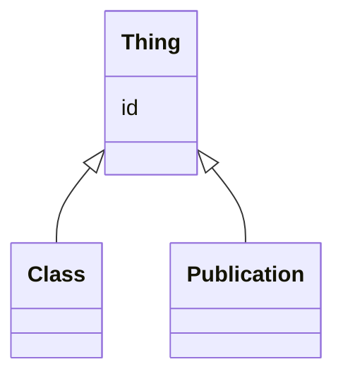

# Class: Thing 


URI: [owl:Class](http://www.w3.org/2002/07/owl#Class)





## Inheritance
* **Thing**
    * [Class](Class.md)
    * [Publication](Publication.md)


## Slots

| Name | Cardinality and Range | Description | Inheritance |
| ---  | --- | --- | --- |
| [id](id.md) | 1 <br/> [Uriorcurie](Uriorcurie.md) | Identifier for the entity | direct |


## Usages

| used by | used in | type | used |
| ---  | --- | --- | --- |
| [Dataset](Dataset.md) | [licence](licence.md) | range | [Thing](Thing.md) |
| [Dataset](Dataset.md) | [assay_type](assay_type.md) | range | [Thing](Thing.md) |
| [Dataset](Dataset.md) | [site](site.md) | range | [Thing](Thing.md) |
| [Sample](Sample.md) | [stage](stage.md) | range | [Thing](Thing.md) |
| [Sample](Sample.md) | [sample_tissue](sample_tissue.md) | range | [Thing](Thing.md) |
| [Assay](Assay.md) | [method](method.md) | range | [Thing](Thing.md) |
| [Cluster](Cluster.md) | [stage](stage.md) | range | [Thing](Thing.md) |
| [Cluster](Cluster.md) | [gene](gene.md) | range | [Thing](Thing.md) |
| [Cluster](Cluster.md) | [cell_type](cell_type.md) | range | [Thing](Thing.md) |


## Identifier and Mapping Information


### Schema Source


* from schema: http://github.org/vfb/vfb-scRNAseq-ontology/VFB_scRNAseq


## Mappings

| Mapping Type | Mapped Value |
| ---  | ---  |
| self | owl:Class |
| native | http://github.org/vfb/vfb-scRNAseq-ontology/VFB_scRNAseq/Thing |


## LinkML Source

<!-- TODO: investigate https://stackoverflow.com/questions/37606292/how-to-create-tabbed-code-blocks-in-mkdocs-or-sphinx -->

### Direct

<details>
```yaml
name: Thing
from_schema: http://github.org/vfb/vfb-scRNAseq-ontology/VFB_scRNAseq
slots:
- id
class_uri: owl:Class

```
</details>

### Induced

<details>
```yaml
name: Thing
from_schema: http://github.org/vfb/vfb-scRNAseq-ontology/VFB_scRNAseq
attributes:
  id:
    name: id
    description: Identifier for the entity. FlyBase identifiers should be prefixed
      with 'FlyBase:'.
    from_schema: http://github.org/vfb/vfb-scRNAseq-ontology/VFB_scRNAseq
    rank: 1000
    identifier: true
    alias: id
    owner: Thing
    domain_of:
    - Thing
    range: uriorcurie
    required: true
class_uri: owl:Class

```
</details>